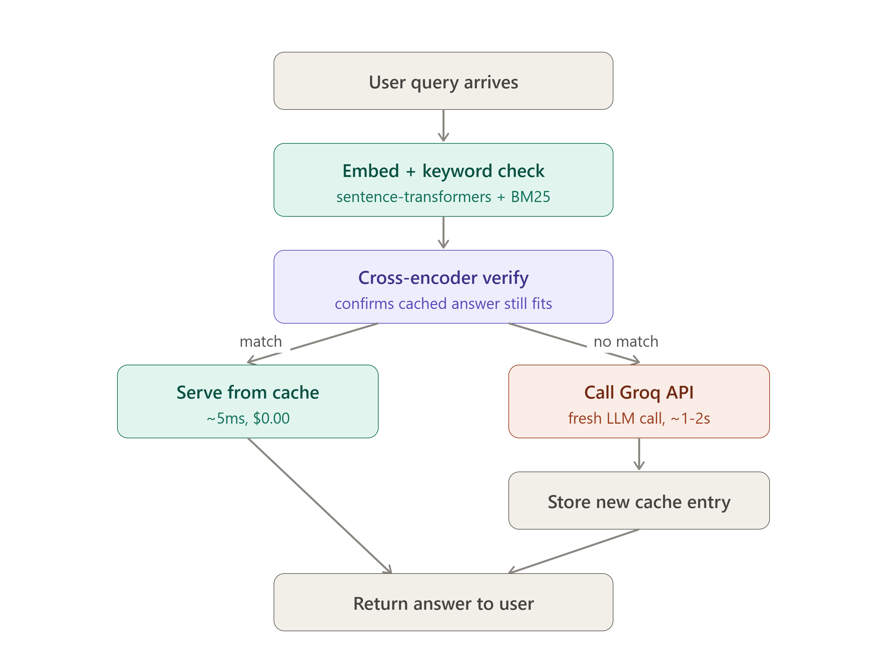

# Semantic-Shift : Semantic Cache Pipeline

> **Slash LLM API costs and latency by intelligently reusing past answers — without sacrificing accuracy.**

A caching proxy that sits in front of an LLM API (Groq) and uses a **three-layer verification pipeline** to decide whether a new query can safely reuse a cached answer. Unlike naive string-matching caches, this system understands that _"How do I reset my password?"_ and _"What are the steps to recover my password?"_ mean the same thing — while correctly rejecting _"How do I delete my account?"_ even though it shares 80 % of the same words.

<p align="center">
  
</p>

---

**🌐 Live Demo:** [https://semantic-shift.syntaxsyndicate.co.in](https://semantic-shift.syntaxsyndicate.co.in/)

---

## ✨ Key Features

- **3-Layer Semantic Verification** — BM25 keyword pre-filter → Cosine Similarity → Cross-Encoder re-ranking
- **Real-Time Dashboard** — KPI cards, query log table, and a live chat-style query tester
- **Live Threshold Tuning** — Adjust all three verification thresholds via sliders without restarting the server
- **Backend Health Monitor** — Live connection status indicator with tooltip
- **Cost & Time Tracking** — Estimated dollars saved and time saved updated per request
- **SQLite Persistence** — Cache survives server restarts with ACID guarantees
- **Single-Command Startup** — One `uvicorn` command serves both the API and the dashboard UI

---

## 🏗️ Architecture

```
User Query
    │
    ▼
┌──────────────────────────────────────────────────────────────────────┐
│                    FastAPI Backend (backend/main.py)                  │
│                                                                      │
│   ┌──────────────┐    ┌──────────────────┐    ┌───────────────────┐  │
│   │  Layer 1      │    │  Layer 2          │    │  Layer 3           │  │
│   │  BM25         │ ──▶│  Cosine           │ ──▶│  Cross-Encoder     │  │
│   │  Pre-filter   │    │  Similarity       │    │  Re-ranking        │  │
│   │  (keyword)    │    │  (embedding)      │    │  (pairwise)        │  │
│   └──────────────┘    └──────────────────┘    └───────────────────┘  │
│         │                     │                        │             │
│    Narrows pool         Picks best match        Confirms intent      │
│    (100 → ~5)           (threshold: 0.85)       (catches traps)      │
│                                                                      │
│   ┌──────────────┐    ┌──────────────────┐                           │
│   │  Groq LLM    │    │  SQLite Cache     │                           │
│   │  (on miss)   │    │  (persistent)     │                           │
│   └──────────────┘    └──────────────────┘                           │
└──────────────────────────────────────────────────────────────────────┘
    │
    ▼
┌──────────────────────────────────────────────────────────────────────┐
│              Frontend Dashboard (frontend/index.html)                │
│                                                                      │
│   ┌──────────────┐  ┌───────────────┐  ┌──────────────────────────┐ │
│   │ Query Tester │  │  Dashboard    │  │  Settings (threshold     │ │
│   │ (chat UI)    │  │  (KPIs +      │  │  sliders + live status)  │ │
│   │              │  │  query log)   │  │                          │ │
│   └──────────────┘  └───────────────┘  └──────────────────────────┘ │
└──────────────────────────────────────────────────────────────────────┘
```

### Why Three Layers?

| Layer                           | Algorithm                                 | Speed  | Purpose                                                                                                    |
| ------------------------------- | ----------------------------------------- | ------ | ---------------------------------------------------------------------------------------------------------- |
| **Layer 1** — BM25              | Keyword overlap (TF-IDF)                  | ⚡⚡⚡ | Cheaply eliminates irrelevant entries. Narrows 100+ entries to ~3–5 candidates.                            |
| **Layer 2** — Cosine Similarity | `all-MiniLM-L6-v2` embeddings (384-dim)   | ⚡⚡   | Finds the semantically closest match among BM25 candidates.                                                |
| **Layer 3** — Cross-Encoder     | `ms-marco-MiniLM-L-6-v2` pairwise scoring | ⚡     | Confirms intent equivalence. This is the layer that catches the "reset password" vs "delete account" trap. |

**Total complexity:** O(n) cheap + O(1) expensive = **fast AND accurate**.

---

## 🚀 Quick Start

### Prerequisites

- Python 3.11+
- A [Groq API key](https://console.groq.com/) (free tier works)

### 1. Clone & Install

```bash
git clone https://github.com/Adinath-Jagtap/Semantic-Shift.git
cd Semantic-Shift

python -m venv .venv
# Windows:
.venv\Scripts\activate
# macOS/Linux:
source .venv/bin/activate

pip install -r requirements.txt
```

### 2. Configure Environment

```bash
cp .env.example .env
```

Edit `.env` and add your Groq API key:

```env
GROQ_API_KEY=gsk_your_key_here
```

### 3. Start the Server

```bash
uvicorn backend.main:app --reload
```

The server will:

- **Fail fast** with a clear error if `GROQ_API_KEY` is missing
- Log all loaded configuration values on startup
- Load any previously cached entries from `cache_store.db`
- Serve the dashboard UI at the root URL

### 4. Open the Dashboard

Navigate to **http://localhost:8000** in your browser. That's it — both the API and the dashboard are served from the same process.

### 5. Run Tests

```bash
pytest tests/ -v
```

---

## 🧪 The Trap-Pair Demo

This is the demo that proves the system works. Try these queries in the Query Tester:

1. **First query:** `"How do I reset my password?"`
   - Result: **CACHE MISS** — no cached entries yet, calls Groq LLM

2. **Second query:** `"What are the steps to recover my password?"`
   - Result: **CACHE HIT** ✅ — the system recognizes this is the same question, returns the cached answer in ~1ms instead of ~2000ms

3. **Third query:** `"How do I delete my account?"`
   - Result: **CACHE MISS** ✅ — despite sharing 80% of the words with query 1, the Cross-Encoder correctly identifies this as a **different intent** and rejects the cache match

This is what naive string-matching or single-layer embedding caches get wrong.

---

## ⚙️ Environment Variables

| Variable                       | Default                | Description                           |
| ------------------------------ | ---------------------- | ------------------------------------- |
| `GROQ_API_KEY`                 | _(required)_           | Your Groq API key                     |
| `GROQ_MODEL`                   | `llama-3.1-8b-instant` | LLM model to use                      |
| `CACHE_SIMILARITY_THRESHOLD`   | `0.85`                 | Min cosine similarity for Layer 2     |
| `CACHE_BM25_MIN_OVERLAP`       | `0.3`                  | Min normalized BM25 score for Layer 1 |
| `CACHE_CROSSENCODER_MIN_SCORE` | `0.5`                  | Min cross-encoder score for Layer 3   |
| `CACHE_PERSIST_PATH`           | `./cache_store.db`     | SQLite database file path             |

All thresholds can also be **tuned live** from the dashboard settings panel without restarting the server.

---

## 📡 API Endpoints

| Endpoint               | Method | Description                                                     |
| ---------------------- | ------ | --------------------------------------------------------------- |
| `/`                    | GET    | Dashboard UI (single-page app)                                  |
| `/v1/chat/completions` | POST   | Main proxy — OpenAI-compatible request shape                    |
| `/stats`               | GET    | Running totals (requests, hits, $ saved, time saved, query log) |
| `/health`              | GET    | Liveness probe                                                  |
| `/config`              | POST   | Read/update verification thresholds at runtime                  |

### Example API Call

```bash
curl -X POST http://localhost:8000/v1/chat/completions \
  -H "Content-Type: application/json" \
  -d '{"messages": [{"role": "user", "content": "What is machine learning?"}]}'
```

**Response:**

```json
{
  "answer": "Machine learning is a subset of artificial intelligence...",
  "cached": false,
  "latency_ms": 1842.3,
  "debug": {
    "reason": "no_similarity_match",
    "best_score": 0.0,
    "threshold": 0.85,
    "candidates": 0
  }
}
```

---

## 🧠 Tech Stack

| Technology                                           | Purpose                                                |
| ---------------------------------------------------- | ------------------------------------------------------ |
| **FastAPI** + **uvicorn**                            | High-performance async API server                      |
| **sentence-transformers** (`all-MiniLM-L6-v2`)       | 384-dim semantic embeddings                            |
| **sentence-transformers** (`ms-marco-MiniLM-L-6-v2`) | Cross-encoder pairwise re-ranking                      |
| **rank-bm25** (`BM25Okapi`)                          | Keyword overlap pre-filtering                          |
| **Groq SDK**                                         | Ultra-low-latency LLM inference (LPU hardware)         |
| **SQLite**                                           | Zero-dependency persistent cache with ACID guarantees  |
| **Vanilla HTML/CSS/JS**                              | Production-grade dashboard UI — no build step required |
| **python-dotenv**                                    | Environment variable loading                           |
| **pydantic**                                         | Request/response validation                            |
| **pytest**                                           | Test framework                                         |

---

## 📁 Project Structure

```
semantic-cache/
├── .env.example              # Environment variable template
├── requirements.txt          # Pinned Python dependencies
├── README.md                 # This file
├── CODE_FLOW.md              # Function-level data flow documentation
├── TECHNICAL_DECISIONS.md    # Library & algorithm rationale
├── cache_store.db            # SQLite cache (auto-created on first run)
│
├── backend/                  # Python backend (FastAPI)
│   ├── __init__.py
│   ├── config.py             # Env loading, validation, mutable settings
│   ├── cache_store.py        # SQLite-backed cache with in-memory hot path
│   ├── verification.py       # 3-layer verification pipeline
│   ├── llm_client.py         # Groq API client
│   └── main.py               # FastAPI app + serves dashboard HTML
│
├── frontend/                 # Dashboard UI (served by FastAPI)
│   └── index.html            # Single-page app (HTML/CSS/JS)
│
└── tests/                    # Test suite
    ├── __init__.py
    ├── conftest.py            # Shared test fixtures
    └── test_verification.py   # 4 pytest cases (incl. trap-pair test)
```

---

## 🧪 Test Cases

| Test                            | Cached Query                  | Test Query                                   | Expected                     |
| ------------------------------- | ----------------------------- | -------------------------------------------- | ---------------------------- |
| `test_empty_cache_returns_miss` | _(none)_                      | "How do I reset my password?"                | MISS (`reason: empty_cache`) |
| `test_paraphrase_returns_hit`   | "How do I reset my password?" | "What are the steps to recover my password?" | **HIT**                      |
| `test_trap_pair_returns_miss`   | "How do I reset my password?" | "How do I delete my account?"                | **MISS**                     |
| `test_threshold_sensitivity`    | "How do I reset my password?" | "How can I change my password?"              | MISS at 0.99, HIT at 0.30    |

---

## ⚠️ Known Limitations (v1)

1. **No streaming response support** — only whole-response replies.
2. **Single-message cache matching** — only the most recent user message is used; multi-turn conversation context is not embedded.
3. **No cache eviction / TTL** — entries persist indefinitely. Fine for a demo, not production.
4. **Single-process only** — cache and stats are not shared across multiple server instances.

These are documented in the code and acknowledged by design — the project never claims capabilities it doesn't have.

---

## 📈 Scalability Roadmap

| Current Design        | Production Change              | When Needed                  |
| --------------------- | ------------------------------ | ---------------------------- |
| In-memory Python list | FAISS index (IVF-PQ) or Qdrant | > 10,000 cache entries       |
| Single SQLite file    | PostgreSQL with pgvector       | Multi-instance deployment    |
| No cache eviction     | TTL-based eviction + LRU       | Cache > 1GB or stale answers |
| Single-process stats  | Redis counters or Prometheus   | Horizontal scaling           |
| No streaming          | SSE / WebSocket streaming      | Production chat UIs          |

---
